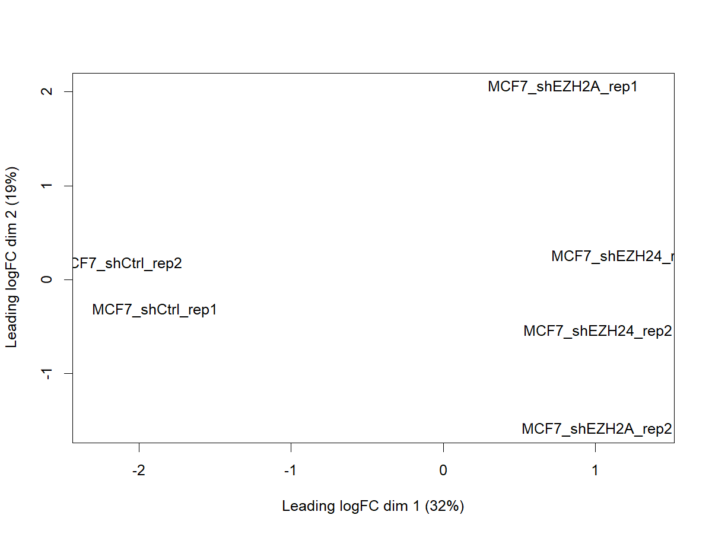
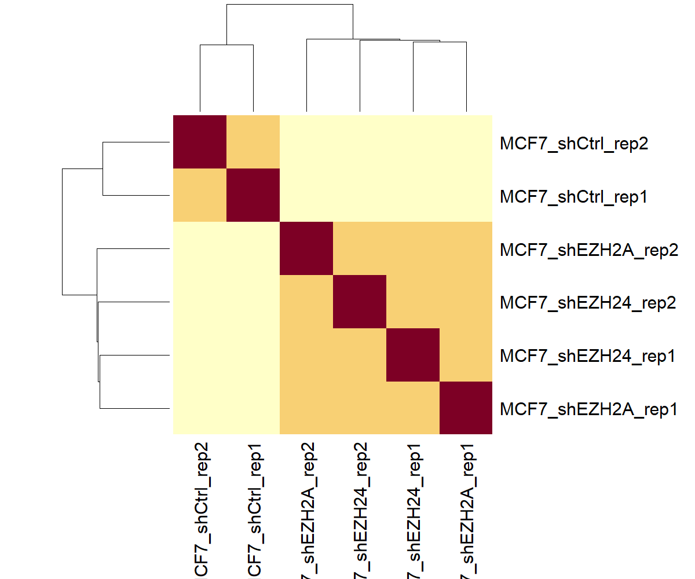
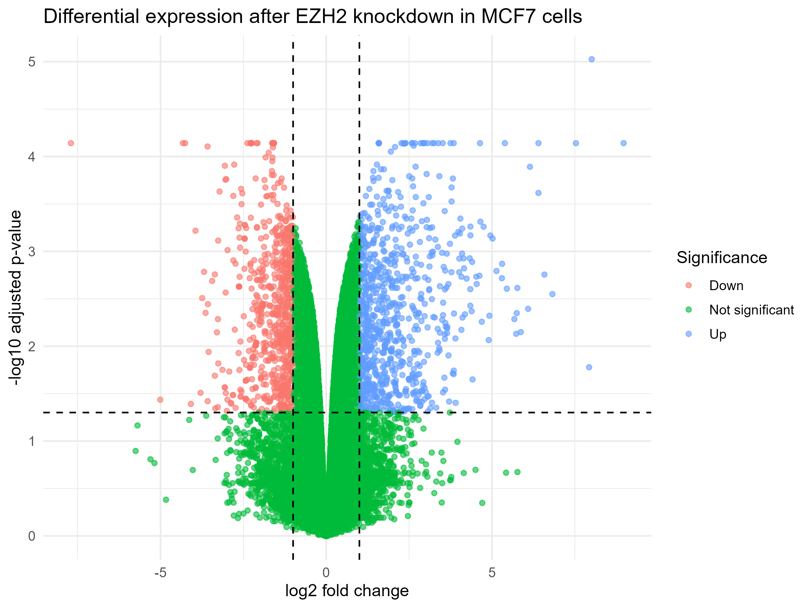
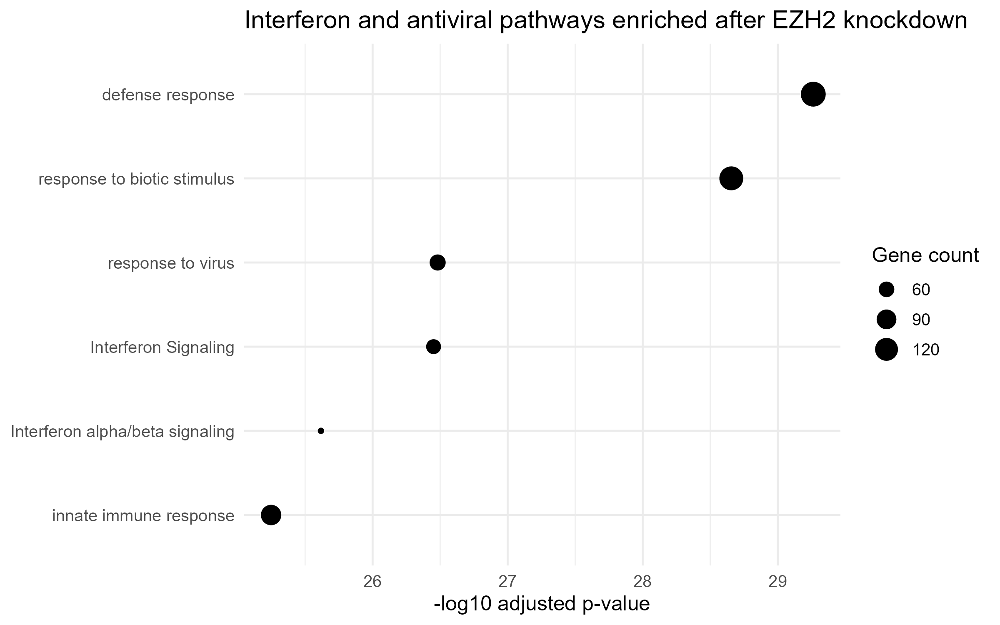
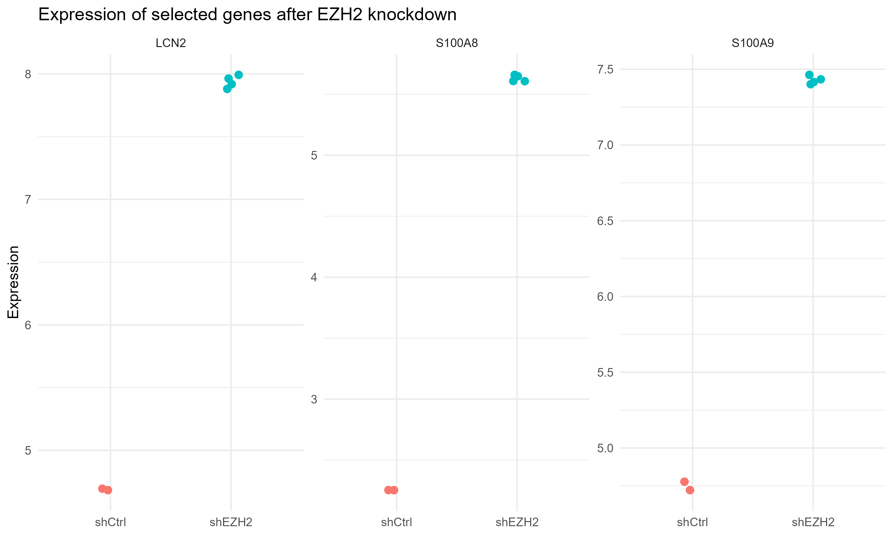

# EZH2 knockdown transcriptomics in MCF7 cells

## Overview

This project analyzes transcriptomic changes following EZH2 knockdown in MCF7 breast cancer cells using the public dataset `GSE183458.2`.

The aim was to identify genes and pathways associated with EZH2 depletion and to evaluate whether the resulting expression changes are consistent with activation of interferon and antiviral response programs.

## Dataset

Expression data and sample metadata were obtained using the `gemma.R` package.

The analyzed subset contained six samples:

- 2 control samples (`shCtrl`)
- 4 EZH2 knockdown samples (`shEZH2`)

Expression columns were explicitly matched to metadata using GSM accession identifiers before downstream analysis.

## Analysis workflow

The analysis included:

- sample metadata inspection and alignment
- expression matrix preparation
- sample-level quality control
- differential expression analysis using `limma`
- gene-level inspection of selected differentially expressed genes
- pathway enrichment analysis using g:Profiler

## Quality control

Pairwise sample correlations were high across all samples, with correlations of approximately 0.98–0.99.

The two control samples showed slightly higher similarity to each other than to EZH2 knockdown samples.

MDS analysis showed clear separation between control and EZH2 knockdown samples along the first dimension, while the second dimension captured additional variability among knockdown samples.

No obvious gross sample outlier was observed.

### MDS

### Sample correlation heatmap

## Differential expression

Genes with zero variance across all samples were removed before model fitting.

Differential expression was tested using `limma` with the contrast:

`shEZH2 - shCtrl`

Positive log2 fold changes therefore indicate higher expression following EZH2 knockdown.

Using the thresholds:

- adjusted p-value < 0.05
- |log2 fold change| ≥ 1

the analysis identified:

- 872 upregulated genes
- 862 downregulated genes
- 28,660 genes not meeting both significance criteria

### Volcano plot

## Pathway enrichment

Gene ontology and pathway enrichment were performed using g:Profiler.

Upregulated genes showed strong enrichment for immune and antiviral response pathways, including:

- Interferon Signaling
- Interferon alpha/beta signaling
- response to virus
- innate immune response
- defense response

These results indicate that EZH2 knockdown is associated with strong activation of interferon-related transcriptional programs.

### Enrichment of upregulated genes

Downregulated genes were enriched for broader developmental, differentiation, signaling, and structural processes.

## Selected differentially expressed genes

Several strongly upregulated genes showed highly consistent expression differences across replicates.

Selected examples include:

- `LCN2`
- `S100A8`
- `S100A9`

For each of these genes, control replicates were highly similar to one another, while all four EZH2 knockdown samples showed consistently elevated expression.

## Interpretation

The analysis supports a strong transcriptional response to EZH2 knockdown in MCF7 cells.

The most prominent pathway-level signal was activation of interferon and antiviral response pathways, suggesting that EZH2 depletion is associated with release of immune-related transcriptional programs.

The consistency of both pathway enrichment and individual gene-expression changes strengthens this interpretation.

## Limitations

This analysis has several limitations:

- the dataset contains only six samples
- the control group contains only two replicates
- the EZH2 knockdown group includes samples with different shRNA labels
- the analysis uses processed expression values obtained from Gemma rather than raw sequencing counts
- residual technical or construct-specific effects may contribute to variation among knockdown samples
- differential expression does not by itself demonstrate a direct regulatory effect of EZH2 on individual genes

## Reproducibility

The full analysis code is available in:

`ezh2-interferon-transcriptomics.R`

Key outputs are stored in:

- `figures/`
- `results/`

The differential expression table is available as:

`results/differential_expression_results.csv`

## Tools

- R
- gemma.R
- limma
- ggplot2
- g:Profiler